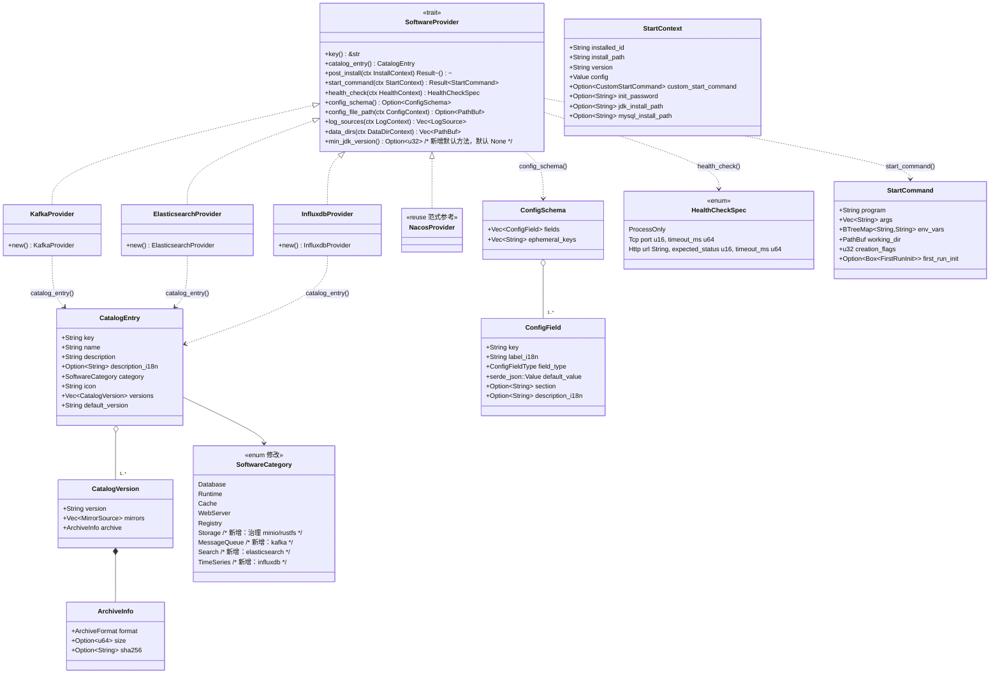
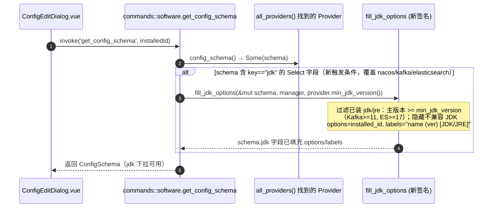
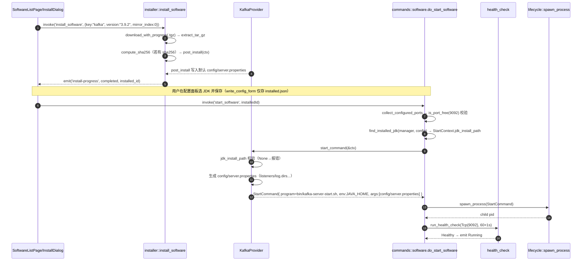
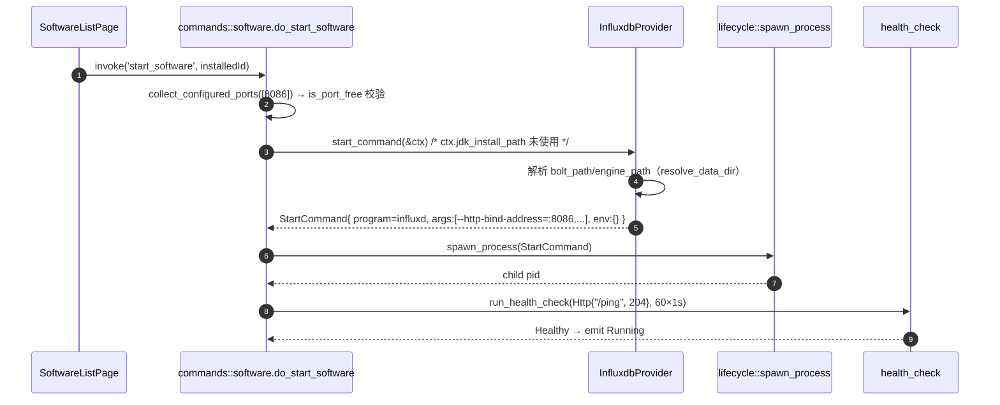

# A 扩展（消息队列 / 搜索 / 时序 Provider）设计文档

> 文档类型：技术设计（Design）
> 分支：`feat/a-new-providers`（当前已检出，不切换）
> 对应 PRD：`2026-08-17-a-new-providers-prd.md`（v1）
> 文档语言：中文
> 技术栈：后端 **Rust + Tauri 2**（沿用现有 `SoftwareProvider` 框架，**不引入新 crate / 新框架**）；前端 **Vue 3 + Pinia + Tailwind CSS**（沿用现有 `software-manager` 模块，复用既有组件，不新增页面）

---

## 1. 实现方案（Implementation Approach）

### 1.1 技术难点与真实代码现状

| 难点 | 真实代码现状（已 Read 核对） |
| --- | --- |
| 复用既有 Provider 框架 | `providers/mod.rs` 的 `SoftwareProvider` trait 已提供 `catalog_entry / start_command / health_check / config_schema / config_file_path / log_sources / data_dirs / post_install` 等默认方法；`nacos.rs` 是 **JDK 复用范式**（`StartContext.jdk_install_path` + 命令层 `find_installed_jdk` 解析 + `fill_jdk_options` 填充下拉）。三类中间件直接套用该框架即可。 |
| JDK 复用 | `commands/software.rs` 的 `find_installed_jdk(manager, config)` 优先取 `config.jdk`（installed_id）→ 回退首个 jdk/jre；结果写入 `StartContext.jdk_install_path`。`start_command(&ctx)` 直接消费。Kafka/ES 与 Nacos 同机制。 |
| 下载安装 | `installer.rs` 的 `install_software` 已支持 `ArchiveFormat::TarGz`（`extract_tar_gz`）、`Zip`、`Executable`、SHA256 校验、进度事件（`downloading`/`extracting`/`completed`）。三类中间件均用 `TarGz`（Windows 平台 ES/InfluxDB 用 `Zip`，见 §6 决策 4）。 |
| **配置落盘（关键发现）** | ⚠️ `config_editor.rs` 的 `detect_format` 仅支持 `Ini / KeyValue / NginxConf / Json / Plaintext`。`*.properties`（Kafka）与 `*.yml`（ES）**均不匹配任何分支 → 落入 `Plaintext` → `write_form_to_config` 对这些格式是 no-op（不写任何字段）**。因此 PRD §A-P0-3/§A-P0-8 假设的「配置写入由既有 config_editor 处理」在 Kafka/ES 上**不成立**。设计见 §1.3 决策。 |
| 分类枚举不一致（待治理） | 后端 `SoftwareCategory`（`models/software.rs`）仅 `Database/Runtime/Cache/WebServer/Registry`；`SoftwareListPage.vue` 的 `grouped` 却硬编码了 `storage` 分组（按 `sw.key` 匹配 minio/rustfs），而 minio/rustfs 的 `catalog_entry().category` 实际是 `Database`。前后端契约不一致。 |
| 端口冲突校验 | `collect_configured_ports` 扫描 config_schema 中 `field_type == Port` 的字段。ES 的 9300 传输端口默认未被任何 Port 字段覆盖，需在 schema 增加 `transport_port`（Port, 9300）。 |

### 1.2 框架 / 库选型（**不引入任何新 crate**）

- **后端**：完全沿用现有 `SoftwareProvider` trait + `installer.rs` + `commands/software.rs`（`start_software` / `do_start_software` / `get_config_schema` / `find_installed_jdk` / `fill_jdk_options`）+ `health_check`（`HealthCheckSpec::Tcp/Http`） + `lifecycle`（杀 PID 复用）+ `config_editor`（仅用于支持 Ini/Json 等的软件；Kafka/ES 见 §1.3 不走此路径）。**无新增 crate**，Cargo.toml 不变。
- **前端**：沿用 Vue3 `<script setup>` + Pinia（`catalog` store） + Tailwind + 既有 `ConfigEditDialog`/`SoftwareInstanceRow`/`LogViewerDialog`/`BackupRestoreDialog`。新增仅 3 个分组 + i18n 词条，**不新增 npm 包**。
- **架构模式**：沿用现有「trait Provider + 命令层 + 服务层」分层；三个新 Provider 是 `SoftwareProvider` 的实现，注册进 `all_providers()` 后由 `build_builtin_catalog()` 自动进入目录。**零新增抽象**。

### 1.3 关键设计决策：Kafka / ES 配置如何落盘（对 PRD 假设的必要修正）

**问题**：PRD 假设 `config_file_path()` 返回 `config/server.properties` / `config/elasticsearch.yml`，且「配置写入由既有 config_editor 处理」。但代码核对证明 `config_editor` 不支持 `.properties` / `.yml`（按 `Plaintext` 处理，写操作无效），且 Kafka 的 `port` 需映射为 `listeners=PLAINTEXT://:9092`、ES 需写入 `discovery.type` 等，字段名与 schema key 并非 1:1，无法用纯 key=value upsert 表达。

**决策（首选，沿用 MinIO/RustFS 既有范式）**：Kafka / ES 的 `config_file_path()` 返回 **`None`**（与 `minio.rs` / `rustfs.rs` 一致），Provider 在 `start_command()` 内部**根据 `ctx.config` 自行生成/覆写** `config/server.properties` / `config/elasticsearch.yml`（纯文本，字段映射由 Provider 代码负责），并在 `post_install()` 写入默认配置。这样：
- `write_config_form` 在 `config_file_path == None` 时只更新 `installed.json` 的 `config`（代码已证实：`if let Some(file_path) = provider.config_file_path(...) { ... }` 跳过），UI 结构化表单完全可用；
- 启动即按最新 `config` 渲染配置，无需扩展 `config_editor`，**零框架风险**；
- 复用框架的 `ephemeral_keys` 机制（InfluxDB 管理员密码不落盘）。

> **备选（留作待明确，见 §8）**：若产品要求「原始配置源码」Tab（`read_config_source` / `write_config_source`）对 Kafka/ES 可用，则需扩展 `config_editor` 新增 `Properties`（`*.properties`，`key=value`、`#`/`!` 注释，逻辑近似 KeyValue）与 `Yaml`（`*.yml`/`*.yaml`，`key: value`、`#` 注释）两种格式，并将 schema 字段 key 严格对齐文件真实键（Kafka 用 `listeners` 而非 `port`）。本设计默认采用首选方案，备选仅在需要原始编辑时启用。

### 1.4 Provider 落盘配置字段映射（生成逻辑）

| Provider | 生成文件 | 由 ctx.config 生成的键值（节选） |
| --- | --- | --- |
| Kafka | `config/server.properties` | `listeners=PLAINTEXT://:{port}`、`log.dirs={解析后 log_dirs}`、`num.partitions=1`、`auto.create.topics.enable=true`、`offsets.topic.replication.factor=1` |
| Elasticsearch | `config/elasticsearch.yml` | `network.host={network_host}`、`http.port={port}`、`transport.port={transport_port}`、`discovery.type: single-node`、`xpack.security.enabled: false`、`path.data: {解析后 data_path}` |

> 说明：`port` 默认 9092 / 9200 / 8086；`log_dirs` 默认 `data/kafka-logs`；`data_path` 默认 `data`；`network_host` 默认 `127.0.0.1`。`{解析后 x}` 用 `mod.rs` 既有 `resolve_data_dir(config, key, default, install_path)` 解析（相对路径按 install_path 拼接）。

---

## 2. 文件清单（File List）

### 2.1 后端（新增 / 修改）

| 相对路径 | 动作 | 作用 |
| --- | --- | --- |
| `src-tauri/src/services/software_manager/providers/kafka.rs` | **新增** | `KafkaProvider`：`SoftwareProvider` 实现（catalog/start/health/schema/log/data_dirs + 生成 server.properties） |
| `src-tauri/src/services/software_manager/providers/elasticsearch.rs` | **新增** | `ElasticsearchProvider`：`SoftwareProvider` 实现（ES_JAVA_HOME 复用 + 生成 elasticsearch.yml） |
| `src-tauri/src/services/software_manager/providers/influxdb.rs` | **新增** | `InfluxdbProvider`：`SoftwareProvider` 实现（原生二进制免 JVM + FirstRunInit 钩子 P1） |
| `src-tauri/src/services/software_manager/providers/mod.rs` | **修改** | ① 新增 `pub mod kafka; pub mod elasticsearch; pub mod influxdb;` ② `all_providers()` 追加三个 `::new()` ③ trait 新增默认方法 `fn min_jdk_version(&self) -> Option<u32> { None }` |
| `src-tauri/src/models/software.rs` | **修改** | `SoftwareCategory` 枚举新增 `MessageQueue` / `Search` / `TimeSeries` / `Storage`（治理 storage 不一致）；其余类型不变 |
| `src-tauri/src/commands/software.rs` | **修改** | ① `get_config_schema` 的 JDK 填充触发条件由 `if software.key == "nacos"` 改为「schema 含 `key=="jdk"` 字段即填充」② `fill_jdk_options` 增加 `min_jdk_version: Option<u32>` 参数，按主版本过滤不兼容 JDK |
| `src-tauri/src/services/software_manager/providers/minio.rs` | **修改** | `catalog_entry().category` 由 `Database` 改为 `Storage`（配合 §6 决策 1 治理） |
| `src-tauri/src/services/software_manager/providers/rustfs.rs` | **修改** | 同上，`category` 由 `Database` 改为 `Storage` |

### 2.2 前端（新增 / 修改）

| 相对路径 | 动作 | 作用 |
| --- | --- | --- |
| `src/models/software.ts` | **修改** | `SoftwareCategory` 枚举同步新增 `MessageQueue` / `Search` / `TimeSeries` / `Storage` |
| `src/modules/software-manager/stores/catalog.ts` | **修改** | `groupedEntries` 的 `groups` 初始化增加 `Storage` / `MessageQueue` / `Search` / `TimeSeries` 四个空分组 |
| `src/modules/software-manager/pages/SoftwareListPage.vue` | **修改** | `grouped` 计算属性新增 `messagequeue` / `search` / `timeseries` 三个分组；minio/rustfs 路由到 `storage` 分组（与 `Storage` 枚举对齐） |
| `src/locales/zh-CN.ts` | **修改** | 新增 `messageQueue` / `search` / `timeSeries` 及对应 `configField.*` 词条 |
| `src/locales/en-US.ts` | **修改** | 同上（英文词条） |

> 注：三个新 Provider 的文件**只需实现 `SoftwareProvider` trait 方法**，无需新增命令、无需改 `lib.rs`（`all_providers()` 自动注册 → `build_builtin_catalog` 自动纳入目录，与 Nacos 完全一致）。

---

## 3. 数据结构与接口（Data Structures & Interfaces）

### 3.1 后端类图（Mermaid classDiagram）



### 3.2 关键 trait 方法签名（节选自真实 `providers/mod.rs`）

```rust
pub trait SoftwareProvider: Send + Sync {
    fn key(&self) -> &str;
    fn catalog_entry(&self) -> CatalogEntry;
    fn post_install(&self, ctx: &InstallContext) -> Result<()>;
    fn start_command(&self, ctx: &StartContext) -> Result<StartCommand>;
    fn health_check(&self, _ctx: &HealthContext) -> HealthCheckSpec { HealthCheckSpec::ProcessOnly }
    fn config_schema(&self) -> Option<ConfigSchema> { None }
    fn config_file_path(&self, _ctx: &ConfigContext) -> Option<PathBuf> { None }
    fn log_sources(&self, ctx: &LogContext) -> Vec<LogSource> { default_log_sources(ctx) }
    fn data_dirs(&self, ctx: &DataDirContext) -> Vec<PathBuf> { default_data_dirs(ctx) }
    // —— A 扩展新增默认方法 ——
    fn min_jdk_version(&self) -> Option<u32> { None }
}
```

### 3.3 三个新 Provider 的 `catalog_entry()` 关键字段值

> 版本与官方 `.tar.gz`/`.zip` 直链已**联网核实**（2026-08-17），写入 `versions` / `mirrors`。平台差异用 `#[cfg(target_os=...)]` 在编译期选取（与 `nacos.rs` 的 `#[cfg(windows)]` 范式一致）。

**KafkaProvider**（`key="kafka"`, `category=MessageQueue`, `icon="mdi:message-text-outline"`）
- 默认版本 `3.9.2`；镜像：`https://downloads.apache.org/kafka/3.9.2/kafka_2.13-3.9.2.tgz`（**TarGz**，跨平台 tgz 含 `bin/kafka-server-start.sh` 与 `bin/windows/kafka-server-start.bat`）。

**ElasticsearchProvider**（`key="elasticsearch"`, `category=Search`, `icon="mdi:magnify"`）
- 默认版本 `8.19.0`；
- `#[cfg(windows)]` → `https://artifacts.elastic.co/downloads/elasticsearch/elasticsearch-8.19.0-windows-x86_64.zip`（`Zip`）；
- `#[cfg(target_os="linux")]` → `https://artifacts.elastic.co/downloads/elasticsearch/elasticsearch-8.19.0-linux-x86_64.tar.gz`（`TarGz`）；
- `#[cfg(target_os="macos")]` → `https://artifacts.elastic.co/downloads/elasticsearch/elasticsearch-8.19.0-darwin-x86_64.tar.gz`（`TarGz`）。

**InfluxdbProvider**（`key="influxdb"`, `category=TimeSeries`, `icon="mdi:chart-line"`）
- 默认版本 `2.9.1`；
- `#[cfg(windows)]` → `https://download.influxdata.com/influxdb/releases/influxdb2-2.9.1-windows_amd64.zip`（`Zip`）；
- `#[cfg(target_os="linux")]` → `https://download.influxdata.com/influxdb/releases/influxdb2-2.9.1_linux_amd64.tar.gz`（`TarGz`）；
- `#[cfg(target_os="macos")]` → `https://download.influxdata.com/influxdb/releases/influxdb2-2.9.1_darwin_amd64.tar.gz`（`TarGz`）。

### 3.4 三个新 Provider 的 `config_schema()` 字段（节选，对齐 `ConfigField`）

| Provider | field.key | label_i18n | field_type | default_value | 备注 |
| --- | --- | --- | --- | --- | --- |
| Kafka | `port` | `configField.kafkaPort` | `Port` | `9092` | 启动时映射为 `listeners=PLAINTEXT://:{port}` |
| Kafka | `heap` | `configField.kafkaHeap` | `Size{m,g}` | `"1g"` | 经 `KAFKA_HEAP_OPTS=-Xms{heap} -Xmx{heap}` 注入 |
| Kafka | `log_dirs` | `configField.kafkaLogDirs` | `Text` | `"data/kafka-logs"` | 经 `resolve_data_dir` 解析 |
| Kafka | `jdk` | `configField.kafkaJdk` | `Select{options:[],labels:[]}` | `""` | 命令层 `fill_jdk_options` 填充 |
| ES | `port` | `configField.esPort` | `Port` | `9200` | → `http.port` |
| ES | `transport_port` | `configField.esTransportPort` | `Port` | `9300` | 纳入 `collect_configured_ports`（§6 决策 6） |
| ES | `heap` | `configField.esHeap` | `Size{m,g}` | `"1g"` | 经 `ES_JAVA_OPTS=-Xms{heap} -Xmx{heap}` 注入 |
| ES | `network_host` | `configField.esNetworkHost` | `Text` | `"127.0.0.1"` | → `network.host` |
| ES | `data_path` | `configField.esDataPath` | `Text` | `"data"` | 经 `resolve_data_dir` 解析 → `path.data` |
| ES | `jdk` | `configField.esJdk` | `Select{options:[],labels:[]}` | `""` | 命令层填充；`min_jdk_version=Some(17)` |
| InfluxDB | `port` | `configField.influxdbPort` | `Port` | `8086` | → `--http-bind-address=:{port}` |
| InfluxDB | `bolt_path` | `configField.influxdbBoltPath` | `Text` | `"data/influxd.bolt"` | → `--bolt-path` |
| InfluxDB | `engine_path` | `configField.influxdbEnginePath` | `Text` | `"data/engine"` | → `--engine-path` |
| InfluxDB | `auth_enabled` | `configField.influxdbAuth` | `Boolean` | `true` | （P0 仅记录，启动参数可据其调整） |
| InfluxDB | `admin_user` | `configField.influxdbAdminUser` | `Text` | `""` | `ephemeral_keys`（不落盘，P1 first_run 用） |
| InfluxDB | `admin_password` | `configField.influxdbAdminPassword` | `Password` | `""` | `ephemeral_keys`（不落盘，P1 first_run 用） |

> **三者的 `config_file_path()` 均返回 `None`**（见 §1.3），因此 `ephemeral_keys` 的「不落盘」由 `write_config_form` 跳过机制天然保证（InfluxDB 的 `admin_*` 本就不写入 installed.json）。

### 3.5 三个新 Provider 的 `start_command()` 关键值

| Provider | program（Unix / Windows） | args | env_vars | working_dir | 生成配置文件 |
| --- | --- | --- | --- | --- | --- |
| Kafka | `bin/kafka-server-start.sh` / `bin/windows/kafka-server-start.bat` | `["config/server.properties"]` | `JAVA_HOME=jdk_install_path`、`KAFKA_HEAP_OPTS=-Xms{heap} -Xmx{heap}` | `install_path` | `config/server.properties` |
| ES | `bin/elasticsearch` / `bin/elasticsearch.bat` | `[]` | `ES_JAVA_HOME=jdk_install_path`、`ES_JAVA_OPTS=-Xms{heap} -Xmx{heap}` | `install_path` | `config/elasticsearch.yml` |
| InfluxDB | `influxd` / `influxd.exe` | `["--http-bind-address=:{port}","--bolt-path={解析后}","--engine-path={解析后}","--log-level=info"]` | `{}`（空） | `install_path` | 无（纯 flag） |

- **JDK 缺失处理**：Kafka/ES 在 `start_command` 开头 `ctx.jdk_install_path.ok_or_else(|| anyhow!("请先安装 JDK/JRE 并在配置中选择后再启动"))`，返回明确错误（与 Nacos 一致）。
- `creation_flags = CREATE_NO_WINDOW`（沿用 `nacos.rs` 的 `#[cfg(windows)]` 常量定义范式）。

### 3.6 三个新 Provider 的 `health_check()` / `log_sources()` / `data_dirs()`

| Provider | `health_check()` | `log_sources()` 追加 | `data_dirs()` 覆写 |
| --- | --- | --- | --- |
| Kafka | `Tcp{ port: config.port 或 9092, timeout_ms:1000 }` | `logs/server.log`（`ProviderFile`, `has_levels=true`） | `resolve_data_dir(config,"log_dirs","data/kafka-logs",install_path)` |
| ES | `Tcp{ port: config.port 或 9200, timeout_ms:1000 }` | `logs/elasticsearch.log`（`ProviderFile`, `has_levels=true`） | `resolve_data_dir(config,"data_path","data",install_path)` |
| InfluxDB | `Http{ url:"http://127.0.0.1:{port}/ping", expected_status:204, timeout_ms:1000 }` | 仅默认 stdout 重定向 | `resolve_data_dir(config,"bolt_path","data/influxd.bolt",install_path).parent()` |

---

## 4. 程序调用流程（Program Call Flow）

### 4.1 配置表单加载（JDK 下拉填充，新触发条件）



### 4.2 Kafka 安装 → 启动（JDK 复用全链路）



### 4.3 InfluxDB 启动（原生二进制，免 JVM）



---

## 5. 任务列表 T1–T6（有序、含依赖、P 级、改动文件）

> 格式：`T{n} — 名称 [依赖] (P级, 覆盖 PRD 需求)`
> 验收均为「可编译（cargo build）/ 可运行 / 行为与 PRD+本设计一致」。

### T1 — 分类枚举扩展与 storage 治理
**依赖**：无　**P0**　**覆盖**：OpenQ1、A-P1-1（枚举部分）
**改动文件**：`src-tauri/src/models/software.rs`（修改）、`src/models/software.ts`（修改）
- [ ] `SoftwareCategory` 后端枚举新增 `MessageQueue` / `Search` / `TimeSeries` / `Storage`（serde 自动派生，不影响序列化既有值）。
- [ ] 前端 `src/models/software.ts` 枚举同步新增四个值。
- [ ] 此任务先于 T2/T4，因为三个 Provider 的 `catalog_entry().category` 引用新枚举值。

### T2 — 三个 Provider 实现 + 注册
**依赖**：T1　**P0**　**覆盖**：A-P0-1~A-P0-16、A-P0-3/8/13（配置生成）、A-P0-4/9/14、A-P0-5/10/15、A-P1-2、A-P1-3
**改动文件**：`providers/kafka.rs`（新）、`providers/elasticsearch.rs`（新）、`providers/influxdb.rs`（新）、`providers/mod.rs`（修改：3×`pub mod` + `all_providers()` 追加 3 个 `::new()` + trait 新增默认方法 `min_jdk_version`）
- [ ] 三文件各实现 §3.3~§3.6 的全部字段与方法；`config_file_path()` 返回 `None`（§1.3）。
- [ ] `kafka.rs` / `elasticsearch.rs` 在 `start_command` 内生成 `config/server.properties` / `config/elasticsearch.yml`（§1.4）；`post_install` 写默认配置。
- [ ] `elasticsearch.rs` 覆写 `min_jdk_version() -> Some(17)`；`kafka.rs` 覆写 `-> Some(11)`；`influxdb.rs` 保持默认 `None`。
- [ ] `mod.rs` 的 `all_providers()` 追加三行；`cargo build` 通过，`all_providers().len()` +3，目录含三软件。

### T3 — 命令层 JDK 填充扩展 + 最低版本过滤
**依赖**：T1（需 `min_jdk_version` 默认方法，可与 T2 同批；逻辑上依赖 T2 的覆写生效）　**P0**　**覆盖**：A-P0-17、OpenQ5
**改动文件**：`src-tauri/src/commands/software.rs`（修改）
- [ ] `get_config_schema` 触发条件由 `if software.key == "nacos"` 改为「任意 `field.key == "jdk"` 的 `ConfigField` 存在即填充」（自动覆盖 nacos/kafka/elasticsearch，见共享知识 §7）。
- [ ] `fill_jdk_options(schema, manager, min_jdk_version: Option<u32>)`：解析已装 JDK 主版本（处理 `1.8.0`→8、`17.0.x`→17），过滤 `< min_jdk_version` 的 JDK/JRE（Kafka 隐藏 <11，ES 隐藏 <17）；`options=installed_id`、`labels="name (ver) [JDK/JRE]"`。
- [ ] `get_config_schema` 调用处传入 `provider.min_jdk_version()`。

### T4 — 前端分类分组 + i18n
**依赖**：T1　**P1**　**覆盖**：A-P1-1（前端部分）
**改动文件**：`src/modules/software-manager/stores/catalog.ts`（修改）、`src/modules/software-manager/pages/SoftwareListPage.vue`（修改）、`src/locales/zh-CN.ts`（修改）、`src/locales/en-US.ts`（修改）
- [ ] `catalog.ts` 的 `groupedEntries.groups` 增加 `Storage` / `MessageQueue` / `Search` / `TimeSeries` 空分组（与枚举对齐）。
- [ ] `SoftwareListPage.vue` 的 `grouped` 新增 `messagequeue`/`search`/`timeseries` 分组（icon 见 §3.3），`kafka→messagequeue`、`elasticsearch→search`、`influxdb→timeseries`、`minio/rustfs→storage`。
- [ ] 两个 locale 新增 `messageQueue`/`search`/`timeSeries` 分组词条与 `configField.*` 字段词条（沿用现有 `categoryRegistry`/`objectStorage` 风格）。

### T5 — InfluxDB 首次初始化（FirstRunInit 钩子，P1）
**依赖**：T2　**P1**　**覆盖**：A-P1-4
**改动文件**：`providers/influxdb.rs`（修改：在 `start_command` 内构造 `first_run_init`）
- [ ] 首次启动（config 无 `initialized` 标记）时，`first_run_init` 调用 `influx setup --username={admin_user} --password={admin_password} --org=opx --bucket=opx --force`；消费 `admin_user`/`admin_password`（ephemeral，不落盘）。
- [ ] 二次启动跳过（`do_start_software` 已有 `initialized` 判跳过逻辑，复用即可）。
- [ ] 注：管理员凭据的一次性传输通道见 §8 待明确（当前 `init_password` 仅 MySQL 使用）。

### T6 — 编译 / 联调 / 回归验证（工程师在物理机实跑，架构师不编译）
**依赖**：T2、T3、T4（T5 可选）　**P0（验收）**　**覆盖**：A-P0-17、整体回归
**改动文件**：无新增（验证既有流程）
- [ ] `cargo build`（src-tauri）通过，无新增警告；`vite build` 通过。
- [ ] 端到端：安装并启动 kafka/elasticsearch（需已装兼容 JDK）/influxdb；健康检查通过；日志源可切换；数据目录备份生效。
- [ ] 端口冲突：ES 9200+9300 均被 `collect_configured_ports` 校验。
- [ ] 兼容性：既有 Nacos/MySQL 等不受影响；`get_config_schema` 对 nacos 仍正常填充 JDK。

---

## 6. 依赖包列表（Dependencies）

- **后端（Rust / Tauri）**：**无新增 crate**。沿用既有 `serde`、`anyhow`、`tauri`、`sha2`、`chrono`、`reqwest`、`uuid` 等。Cargo.toml 无需改动。
- **前端（Vue3）**：**无新增 npm 包**。沿用 `vue` / `pinia` / `tailwindcss` / `@tauri-apps/api` / `vue-i18n` / `@iconify/vue`。package.json 无需改动。
- 所有能力通过「新增 Provider 文件 + 注册进 `all_providers()` + 复用现有命令/服务」实现。

---

## 7. 共享知识（跨文件约定，供工程师编码遵循）

1. **JDK 下拉填充统一触发条件**：`get_config_schema` 中「凡 `config_schema()` 返回的字段里存在 `key == "jdk"` 的 `Select` 字段，即调用 `fill_jdk_options`」。今后任何 Java 中间件只需在 schema 加 `jdk` 字段即可自动获得已装 JDK 下拉，**无需再在命令层加 `if software.key == "xxx"`**。
2. **`min_jdk_version` 声明位置**：Provider 覆写 trait 默认方法 `min_jdk_version()`（Kafka=11，ES=17，其余默认 `None`）；命令层在 `fill_jdk_options` 中据此过滤不兼容 JDK。
3. **JDK 主版本解析规则**（写进 `fill_jdk_options`）：版本串以 `1.` 开头取第二段（`1.8.0`→8），否则取首段（`17.0.12`→17、`21`→21）。
4. **`config_file_path()` 对 Kafka/ES 返回 `None`**：配置由 Provider 在 `start_command` 内据 `ctx.config` 生成（§1.3）。`ephemeral_keys` 字段（InfluxDB `admin_*`）天然不落盘。
5. **相对数据/日志目录解析**：统一调用 `providers/mod.rs` 既有 `resolve_data_dir(config, key, default, install_path)`，相对路径按 `install_path` 拼接、绝对路径原样返回。
6. **`CREATE_NO_WINDOW`**：Windows 前台启动常量沿用 `nacos.rs` 的 `#[cfg(windows)] const CREATE_NO_WINDOW: u32 = 0x08000000` 范式。
7. **平台相关下载 URL/格式**：用 `#[cfg(target_os="windows"|"linux"|"macos")]` 在 `catalog_entry()` 编译期选取对应 `MirrorSource`（URL + `ArchiveFormat`）；Windows 上 ES/InfluxDB 为 `Zip`，其余为 `TarGz`（Kafka tgz 跨平台）。
8. **ES 单机开发模式**：生成 `elasticsearch.yml` 固定写 `discovery.type: single-node` 与 `xpack.security.enabled: false`，避免首次启动交互式生成密码/证书（贴合本地开发场景）。

---

## 8. 待明确事项（Anything UNCLEAR）

1. **InfluxDB 管理员凭据的一次性传输通道**：`do_start_software` 目前仅接收 `init_password: Option<String>`（MySQL 用）。InfluxDB `first_run_init` 需 `admin_user`/`admin_password`，而二者 `ephemeral` 不落盘。候选方案：(a) 复用 `init_password` 仅传密码、用户名固定 `opx`；(b) 扩展 `do_start_software` 接收 `init_secrets: Option<HashMap>`；(c) P1 暂不做首次初始化（`influx setup` 由用户手动 CLI 完成），P0 仅保证 `influxd` 启动且 `/ping` 通过。**推荐 (c) 作为 P0 最小闭环，P1 再做 (b)**。
2. **ES 禁止 root 运行**：ES 8.x 拒绝以 root 启动（Linux）。opx 作为桌面应用通常以普通用户运行无碍；若部署场景涉及 root，需文档提示。标记为已知约束。
3. **配置「原始源码」编辑（read/write_config_source）对 Kafka/ES**：因 `config_file_path()==None`，该 Tab 对二者不可用（与 MinIO/RustFS 一致）。若产品要求可用，启用 §1.3 备选（扩展 `config_editor` 支持 `Properties`/`Yaml`）。当前默认不启用。
4. **Kafka 默认版本 3.9.2 的 Scala 构建号**：采用官方推荐 `kafka_2.13-3.9.2.tgz`（Scala 2.13）。如用户环境锁定 Scala 2.12，可改用 `kafka_2.12-3.9.2.tgz`（同 URL 模式），不影响设计。
5. **ES 版本锁**：默认 `8.19.0`（8.x 最新小版本线 8.19 的首发）。如需锁定具体补丁号（如 8.19.20），仅改 `versions` 中 URL 与 `default_version`，无需改代码逻辑。
6. **InfluxDB 2.9.1 官方 Windows 包为 `.zip`**（`influxdb2-2.9.1-windows_amd64.zip`），与 Linux/macOS 的 `.tar.gz` 不同；已由 `#[cfg(windows)]` 分别处理 `ArchiveFormat`（见 §3.3）。

---

## 9. PRD §5 六个 Open Questions —— 默认决策（逐条）

| # | 问题 | 本设计决策 | 是否偏离默认 |
| --- | --- | --- | --- |
| 1 | 分类枚举 | 后端/前端 `SoftwareCategory` 新增 `MessageQueue`/`Search`/`TimeSeries`；**同时治理 storage 不一致**：新增 `Storage` 枚举值，minio/rustfs 的 `category` 由 `Database` 改为 `Storage`，`catalog.ts`/`SoftwareListPage.vue` 分组与枚举对齐。 | 按默认（含 storage 治理，采纳「纳入枚举」建议） |
| 2 | Kafka 启动方式 | 采用官方 `bin/kafka-server-start.sh`（Unix）/`bin/windows/kafka-server-start.bat`（Windows），前台运行、设 `JAVA_HOME`。**不**像 Nacos 那样直连 `java -jar`（Kafka 无单一 jar，必须走官方脚本）；daemon 化不做（破坏 PID 管理，与 Nacos 决策一致）。 | 按默认（理由与 Nacos 对齐） |
| 3 | ES 的 JDK | 采用 `ES_JAVA_HOME = 已配 JDK`（满足复用需求），schema/文档注明 ES 8.x 需 JDK 17+；`min_jdk_version=Some(17)` 在 `fill_jdk_options` 过滤掉 <17 的 JDK。 | 按默认 |
| 4 | 默认版本与下载源 | **已联网核实**：Kafka `3.9.2`（`downloads.apache.org/kafka/3.9.2/kafka_2.13-3.9.2.tgz`）、ES `8.19.0`（artifacts.elastic.co，按平台 tgz/zip）、InfluxDB `2.9.1`（download.influxdata.com，按平台 tgz/zip）。版本号与 URL 已写入 §3.3 的 `catalog_entry`。 | 按默认（已补真实 URL） |
| 5 | JDK 版本过滤 | `fill_jdk_options` 增加按软件最低 JDK 版本过滤（Kafka 最低 11、ES 最低 17），隐藏不兼容 JDK；最低版本由 Provider 覆写 `min_jdk_version()` 声明。 | 按默认 |
| 6 | 端口冲突 | ES 的 9300 传输端口纳入 `collect_configured_ports`：在 ES schema 新增 `transport_port`（`Port`，默认 9300）字段，`collect_configured_ports` 扫描所有 `Port` 字段即自动覆盖 9200+9300。 | 按默认 |
