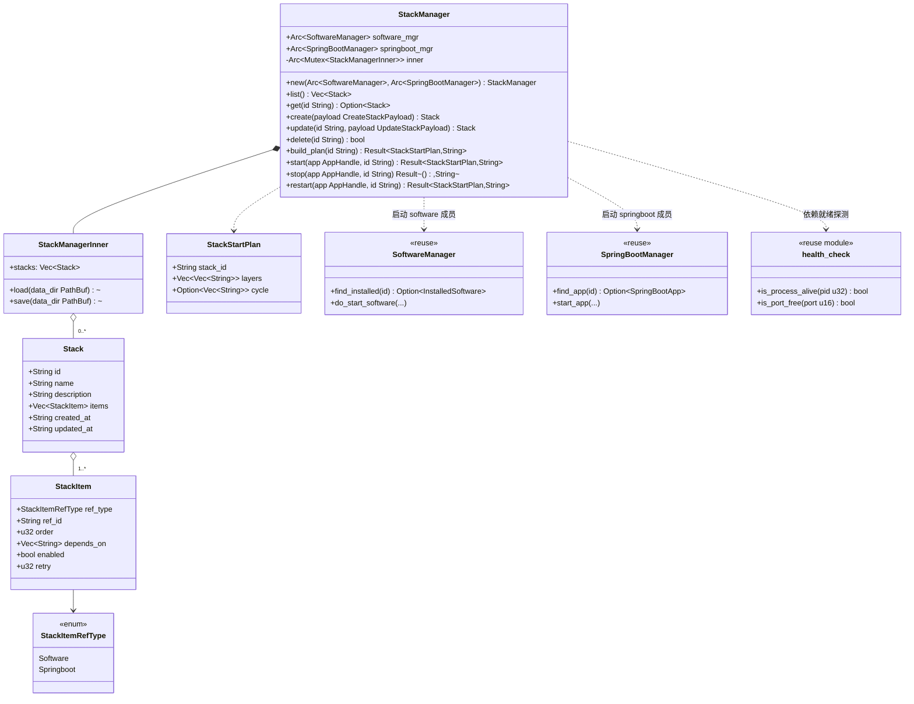
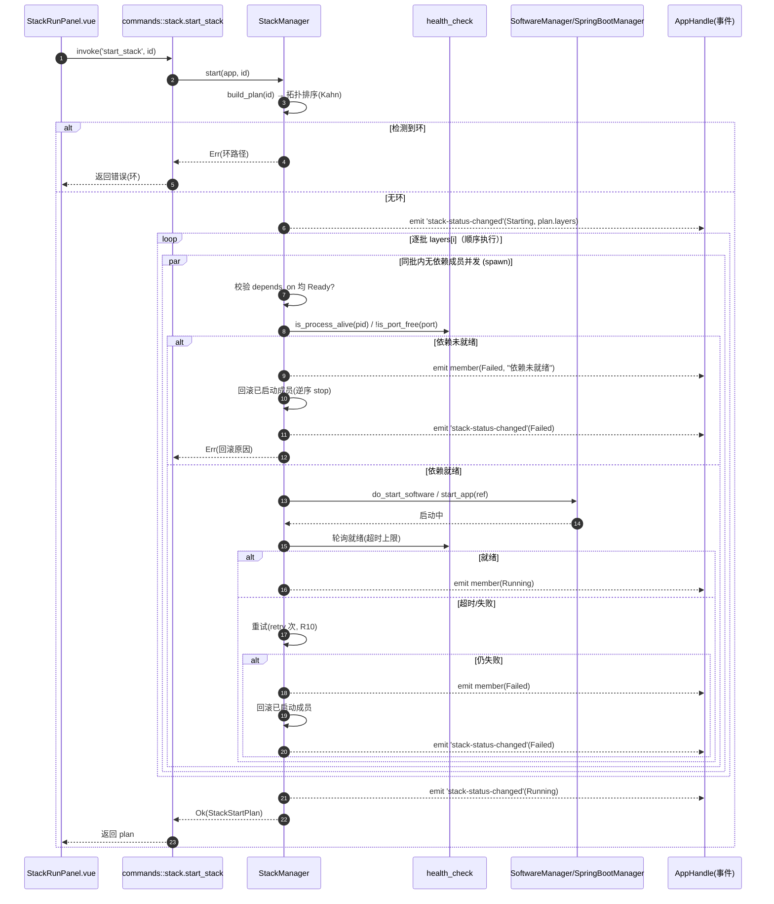
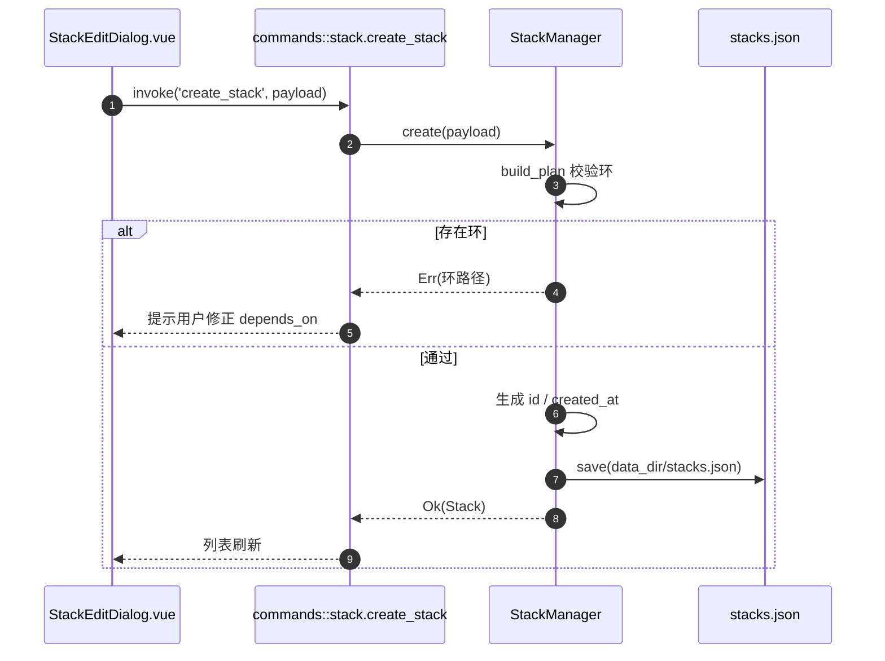

# B 扩展（一键启动栈 Stack）设计文档

> 文档类型：技术设计（Design）
> 分支：`feat/b-stack-start`
> 对应 PRD：`2026-08-17-b-stack-start-prd.md`（v0.1）
> 文档语言：中文
> 技术栈：前端 Vite + **Vue 3 + Pinia + Tailwind CSS**；后端 **Rust + Tauri（沿用现有命令/服务，不引入新 crate / 新框架）**

---

## 1. 实现方案（Implementation Approach）

### 1.1 技术难点

| 难点 | 说明 |
| --- | --- |
| 跨模块统一编排 | `InstalledSoftware`（已装软件）与 `SpringBootApp` 分属两个 Manager，需以"引用（ref_type + ref_id）"方式统一纳入同一栈。 |
| 依赖驱动的启动顺序 | 现有 `auto_start_all` 仅按 `startup_order` 盲等 500ms，**不等待依赖就绪**；B 需自建拓扑排序 + 依赖就绪探测 + 逐批启动。 |
| 环检测 | 用户配置的 `depends_on` 可能成环，必须静态检测并在保存/启动时报错。 |
| 兼容现有自动启动 | 不能破坏既有 `auto_start_on_app_start` + `startup_order` 与 Spring Boot `auto_start`/`depends_on` 行为。 |

### 1.2 框架 / 库选型（**不引入任何新 crate / npm 包**）

- **后端**：沿用 Tauri 命令（`#[tauri::command]`）+ 现有 `SoftwareManager` / `SpringBootManager`（`Arc<...>` State）+ `serde`（已依赖）+ `std::collections` + `tauri::async_runtime::spawn`（并发逐批）。**不新增 crate**。
- **健康检查复用**：直接复用 `services/software_manager/health_check.rs` 的 `is_process_alive(pid)`、`is_port_free(port)`，零新增依赖即获得依赖就绪判定能力。
- **前端**：沿用 Vue 3 `<script setup>` + **Pinia**（状态）+ **Tailwind CSS**（样式）+ 现有 `tauri` JS API（`@tauri-apps/api` 已依赖）+ 现有 `i18n`。**不新增 npm 包**。（注：PRD §0 模板写的是 React+MUI，实际仓库前端为 Vue3+Pinia+Tailwind，以实际仓库为准。）
- **架构模式**：后端 CQRS 风格命令层 + 服务层（`StackManager`）；前端 列表/编辑/运行 视图 + Pinia store。

### 1.3 模块划分

```
后端:
  models/stack.rs            —— 数据模型 + serde
  services/stack_manager.rs  —— 栈持久化 + 拓扑排序 + 逐批编排
  commands/stack.rs          —— 8 个 Tauri 命令
  lib.rs                     —— 注册 StackManager State + 8 命令

前端:
  stores/stack.ts            —— Pinia store（封装命令调用 + 运行态）
  modules/stack/StackList.vue
  modules/stack/StackEditDialog.vue
  modules/stack/StackRunPanel.vue
  router/index.ts            —— 新增 /stacks 路由
  layouts/Sidebar.vue        —— 新增「栈 / Stacks」入口
```

---

## 2. 文件清单（File List）

### 2.1 后端（新增）

| 相对路径 | 作用 |
| --- | --- |
| `src-tauri/src/models/stack.rs` | `Stack` / `StackItem` / `StackItemRefType` / 运行态枚举，serde 派生 |
| `src-tauri/src/services/stack_manager.rs` | `StackManager`：加载/保存 `stacks.json`、拓扑排序、环检测、逐批启动/停止/重启、状态聚合 |
| `src-tauri/src/commands/stack.rs` | `list_stacks` / `get_stack` / `create_stack` / `update_stack` / `delete_stack` / `start_stack` / `stop_stack` / `restart_stack` |
| `src-tauri/src/models/mod.rs` | 新增 `pub mod stack;` |
| `src-tauri/src/commands/mod.rs` | 新增 `pub mod stack;` |
| `src-tauri/src/lib.rs` | 注册 `StackManager` State（携带 `Arc<SoftwareManager>` + `Arc<SpringBootManager>`），并在 `invoke_handler!` 注册 8 个命令 |
| `src-tauri/src/services/software_manager/health_check.rs` | **复用不修改**（仅调用 `is_process_alive` / `is_port_free`） |
| `src-tauri/src/services/software_manager/lifecycle.rs` | **复用不修改**（按需在 Rust 内调用 `do_start_software`） |
| `src-tauri/src/services/springboot_manager/lifecycle.rs` | **复用不修改**（按需在 Rust 内调用 `start_app`） |

### 2.2 前端（新增 / 修改）

| 相对路径 | 作用 |
| --- | --- |
| `src/stores/stack.ts` | Pinia store：封装 8 个命令的 invoke、运行态缓存、订阅 `stack-status-changed` |
| `src/modules/stack/StackList.vue` | 栈列表页（卡片/表格 + 启动/停止/编辑/删除/导出） |
| `src/modules/stack/StackEditDialog.vue` | 创建/编辑对话框（勾选成员、拖拽排序、`depends_on` 下拉） |
| `src/modules/stack/StackRunPanel.vue` | 运行面板（依赖图 + 各成员实时状态徽标 + 进度） |
| `src/router/index.ts` | 新增 `/stacks` 路由（**修改**） |
| `src/layouts/Sidebar.vue` | 新增「栈 / Stacks」侧边栏入口（**修改**） |
| `src/models/stack.ts` | 前端类型声明（与后端 serde 对应） |
| `src/locales/...` | 新增 `stack` 相关 i18n 词条（**修改**） |

---

## 3. 数据结构与接口（Data Structures & Interfaces）

### 3.1 后端数据模型（`models/stack.rs`）

```rust
use serde::{Deserialize, Serialize};
use std::collections::HashMap;

#[derive(Debug, Clone, Copy, Serialize, Deserialize, PartialEq, Eq)]
#[serde(rename_all = "snake_case")]
pub enum StackItemRefType {
    Software,   // 引用 InstalledSoftware.id
    Springboot, // 引用 SpringBootApp.id
}

#[derive(Debug, Clone, Serialize, Deserialize)]
pub struct StackItem {
    pub ref_type: StackItemRefType,
    pub ref_id: String,            // 栈内唯一引用键
    pub order: u32,                // 同层 tie-break（升序）
    #[serde(default)]
    pub depends_on: Vec<String>,   // 依赖的 StackItem.ref_id（栈内引用）
    #[serde(default = "default_true")]
    pub enabled: bool,             // 是否纳入编排（默认 true）
    #[serde(default)]
    pub retry: u32,                // 启动失败重试次数（R10，默认 0）
}

#[derive(Debug, Clone, Serialize, Deserialize)]
pub struct Stack {
    pub id: String,
    pub name: String,
    #[serde(default)]
    pub description: String,
    pub items: Vec<StackItem>,
    pub created_at: String,        // ISO 8601 UTC
    #[serde(default)]
    pub updated_at: String,
}

// —— 运行态（不持久化）——
#[derive(Debug, Clone, Copy, Serialize, Deserialize, PartialEq, Eq)]
#[serde(rename_all = "snake_case")]
pub enum StackMemberStatus {
    Pending, Starting, Running, Stopping, Stopped, Failed,
}

#[derive(Debug, Clone, Serialize, Deserialize)]
pub struct StackMemberRuntime {
    pub ref_id: String,
    pub status: StackMemberStatus,
    #[serde(default)]
    pub message: String,
}

#[derive(Debug, Clone, Serialize, Deserialize)]
pub struct StackStartPlan {
    pub stack_id: String,
    pub layers: Vec<Vec<String>>,      // 逐批顺序：layers[0] 为第一批
    pub cycle: Option<Vec<String>>,    // 检测到环时返回环路径
}

#[derive(Debug, Clone, Serialize, Deserialize)]
pub struct CreateStackPayload {
    pub name: String,
    #[serde(default)]
    pub description: String,
    pub items: Vec<StackItem>,
}

#[derive(Debug, Clone, Serialize, Deserialize)]
pub struct UpdateStackPayload {
    #[serde(default)]
    pub name: Option<String>,
    #[serde(default)]
    pub description: Option<String>,
    #[serde(default)]
    pub items: Option<Vec<StackItem>>,
}

// 事件 payload
#[derive(Debug, Clone, Serialize, Deserialize)]
pub struct StackStatusEvent {
    pub stack_id: String,
    pub status: StackMemberStatus,         // 整体栈状态（Running/Failed/...）
    pub members: Vec<StackMemberRuntime>,
}
```

### 3.2 后端服务与命令（`Mermaid classDiagram`）



### 3.3 新增 Tauri 命令签名（`commands/stack.rs`）

> 所有命令均复用 `State<'_, Arc<StackManager>>`，与现有 `start_software` / `start_springboot_app` 风格一致，返回 `Result<T, String>`。

```rust
#[tauri::command]
pub async fn list_stacks(manager: State<'_, Arc<StackManager>>) -> Result<Vec<Stack>, String>;

#[tauri::command]
pub async fn get_stack(manager: State<'_, Arc<StackManager>>, id: String) -> Result<Stack, String>;

#[tauri::command]
pub async fn create_stack(
    manager: State<'_, Arc<StackManager>>,
    payload: CreateStackPayload,
) -> Result<Stack, String>;

#[tauri::command]
pub async fn update_stack(
    manager: State<'_, Arc<StackManager>>,
    id: String,
    payload: UpdateStackPayload,
) -> Result<Stack, String>;

#[tauri::command]
pub async fn delete_stack(manager: State<'_, Arc<StackManager>>, id: String) -> Result<(), String>;

#[tauri::command]
pub async fn start_stack(
    manager: State<'_, Arc<StackManager>>,
    app: AppHandle,
    id: String,
) -> Result<StackStartPlan, String>;

#[tauri::command]
pub async fn stop_stack(
    manager: State<'_, Arc<StackManager>>,
    app: AppHandle,
    id: String,
) -> Result<(), String>;

#[tauri::command]
pub async fn restart_stack(
    manager: State<'_, Arc<StackManager>>,
    app: AppHandle,
    id: String,
) -> Result<StackStartPlan, String>;
```

> 说明：`create_stack`/`update_stack` 内部调用 `build_plan` 做**保存前环检测**；若 `cycle.is_some()` 则拒绝保存并返回环路径。

---

## 4. 程序调用时序（Program Call Flow）

### 4.1 `start_stack` 拓扑排序 + 逐批启动（核心，Mermaid sequenceDiagram）



### 4.2 `create_stack`（含保存前环检测）



---

## 5. `start_stack` 逐批启动算法（伪代码）

```text
fn build_plan(stack) -> Result<StackStartPlan, String>:
    nodes   = stack.items.filter(enabled)
    indeg   = { ref_id: count(depends_on ∩ nodes) for each node }
    graph   = { ref_id: [dependents...] }
    queue   = nodes where indeg == 0, sorted by `order` asc
    layers  = []
    visited = 0
    while queue not empty:
        layer = queue; layers.append(layer.map(ref_id))
        next_q = []
        for n in layer:
            for m in graph[n]: indeg[m] -= 1; if indeg[m]==0: next_q.push(m)
        next_q.sort_by(order); queue = next_q; visited += layer.len
    if visited != nodes.len:
        return Err(cycle_path)        // 残留 indeg>0 即环
    return Ok(StackStartPlan{layers})

fn start(app, stack):
    plan = build_plan(stack)?         // 运行前再次检测环
    emit stack-status-changed(Starting, plan)
    started = []
    for layer in plan.layers:          // 批间顺序
        tasks = layer.map(|ref_id| spawn(start_one(app, ref_id)))
        results = join(tasks)          // 批内并发
        for (ref_id, r) in results:
            if r.is_err:
                rollback(started)      // R9 自动回滚
                emit stack-status-changed(Failed)
                return Err(...)
            started.push(ref_id)
    emit stack-status-changed(Running)
    return Ok(plan)
```

`start_one(app, ref_id)`：
1. 校验其 `depends_on` 对应成员均处于 `Running`（依赖就绪，R9）；
2. 依 `ref_type` 调用 `SoftwareManager::do_start_software` 或 `SpringBootManager::start_app`；
3. 轮询就绪（`is_process_alive` + 可选 `!is_port_free(port)`，超时上限 `READY_TIMEOUT_MS`）；
4. 失败按 `retry` 重试（R10）；仍失败返回 Err。

---

## 6. PRD §6 七个待确认问题 —— 默认决策（逐条）

| # | 问题 | 默认决策 |
| --- | --- | --- |
| 1 | Spring Boot `depends_on` 是否在编排中生效？ | **B 自建拓扑排序**为权威；栈 `depends_on` 独立生效，并以引用方式桥接 Spring Boot 既有 `depends_on`（仅作候选来源，不在 Spring Boot 自身编排中消费）。 |
| 2 | 已装软件"就绪"判定信号？ | **复用 `health_check::is_process_alive` + `is_port_free`**（端口监听态视为就绪，无端口服务回退为进程存活）。无需新增健康检查代码。 |
| 3 | `order` 与 `depends_on` 冲突？ | **`depends_on` 拓扑序为主**，`order` 仅作同层 tie-break（同批/同层内按 `order` 升序排列）。 |
| 4 | 持久化位置？ | **新建 `data_dir/stacks.json`**，由 `StackManager` 独立读写，与 `installed.json`/`apps.json` 解耦，不改动现有 store。 |
| 5 | 与"应用启动自动拉起"共存？ | P0 **不并入** `auto_start_all`，现有自启行为不变；栈级自启作为 **P2 R11** 后续提供开关并以栈 `order` 楔入 `auto_start_all`。 |
| 6 | 跨模块状态聚合？ | **新增栈级事件 `stack-status-changed`**，后端在 `start/stop/restart` 中聚合各成员 `software-status-changed`/`springboot-status-changed`，前端统一订阅刷新（R8）。 |
| 7 | 环检测与并发度？ | 拓扑排序发现环即**拒绝并返回明确环路径错误**（UI 提示修正）；**同层无依赖成员允许并发启动**（批内 `spawn` 并行，预留 `max_batch_concurrency` 上限配置）。 |

---

## 7. 待明确 / 假设（Anything UNCLEAR）

- **成员就绪端口来源**：栈本身不存储端口；就绪判定需从被引用模型（`InstalledSoftware` / `SpringBootApp`）读取监听端口。假设这两个模型已暴露端口字段（如 `port: Option<u16>`）；若实际字段名不同，由 `StackManager` 适配层统一取端口，不影响对外接口。
- **`do_start_software` 可见性**：假设 `services/software_manager/lifecycle.rs` 中启动逻辑可从 `StackManager` 直接调用（必要时将内部 `do_start_software` 提升为 `pub`）。`springboot` 侧 `start_app` 已为 `pub`（见 `commands/springboot.rs:69`）。
- **回滚语义**：R9 回滚仅停止"本次已在本栈启动"的成员，不触碰用户此前手动启动的、非本栈启动的实例。
- **P2（R11~R13）** 不在本期 P0 实现范围，设计预留扩展点（栈级 `auto_start` 字段、`template` 字段、`last_run_report` 字段可在后续版本加入，不影响现有结构）。
- **`Ready_TIMEOUT_MS` / `max_batch_concurrency`** 默认值（如 30s / 不限制）留作 `StackManager` 常量，可在 P1 调优。
