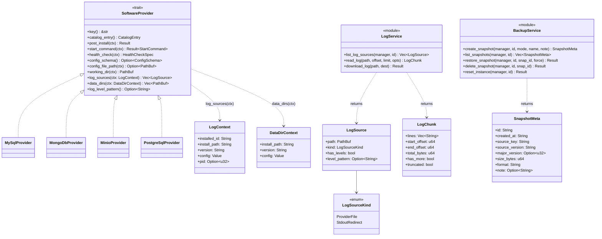
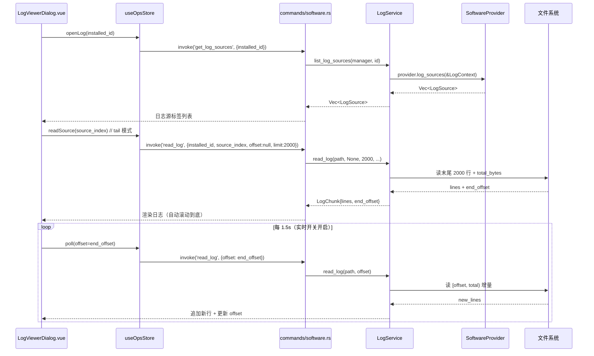
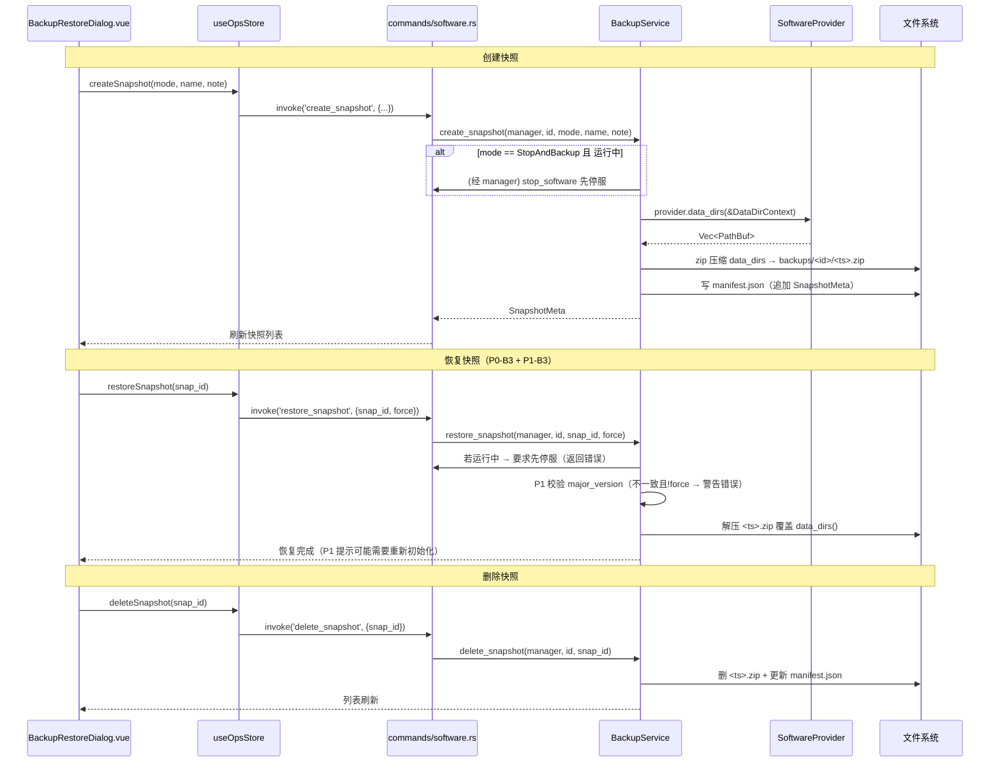
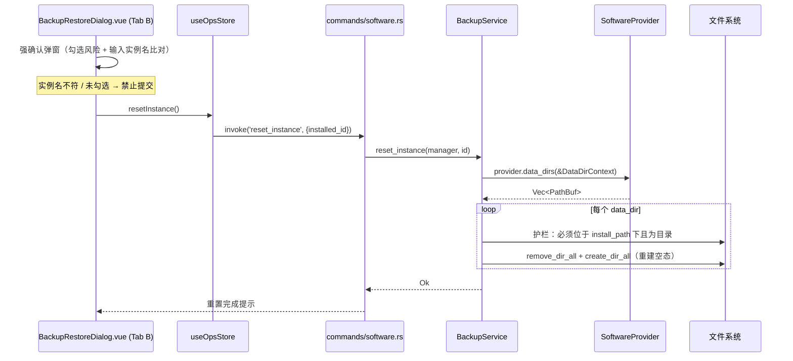

# C 扩展方向：实例运维能力（日志查看器 + 备份/恢复）系统架构设计

> 文档类型：系统架构设计（实现方案 + 文件列表 + 数据结构/接口 + 调用流程 + 依赖 + 共享知识 + 待明确）
> 关联 PRD：`docs/superpowers/specs/2026-08-17-c-ops-logs-backup-prd.md`
> 已拍板决策：见 PRD「8 条决策」与 team-lead 任务书（用户确认按 PM 建议执行）
> 技术栈：**Tauri 2（Rust 后端 `src-tauri/` + Vue3 前端 `src/modules/software-manager/`）**，沿用现有命令式 Rust + 组件化 Vue，不引入新框架。

---

## 1. 实现方案

### 1.1 核心难点与框架选型

| 难点 | 方案 | 说明 |
|---|---|---|
| **P0-L5 前置：stdout 落盘** | 改造 `spawn_process` 把 `stdout+stderr` 重定向到 `<install_path>/logs/opx-<installed_id>.log` | 当前为 `Stdio::null()`（lifecycle.rs L137-140）。改用 `Stdio::from(File::create(path))`——子进程继承 fd，父进程可立即 drop，无管道阻塞风险。文件名用 `installed_id` 而非 `pid`：**pid 在 spawn 前无法获得**，且 Windows 下 rename 打开中的文件会失败；用 `installed_id` 可在 spawn 前确定路径，跨平台安全。`pid` 仍照旧写入 `ProcessRegistry` 供展示。 |
| **两类日志来源统一抽象** | 新增 `LogSource { path, kind, has_levels, level_pattern }` + trait 方法 `log_sources(&LogContext)` | 默认实现返回 `[StdoutRedirect(...)]`；provider 可追加 `ProviderFile`（如 MongoDB 的 `data/mongod.log`）。后续 B（一键启停栈）/ A（新 provider）零改动复用。 |
| **data 目录通用暴露** | trait 方法 `data_dirs(&DataDirContext) -> Vec<PathBuf>` | 默认 `[<install_path>/data]`；MinIO/RustFS/MongoDB 按 config 解析（与各自 `start_command` 逻辑一致）。备份/重置均基于它，无需硬编码。 |
| **大文件流式读取** | `read_log` 按 offset/limit 读取；tail 模式返回末尾 N 行 + 当前字节偏移 | 前端持偏移轮询增量。默认末尾 2000 行，历史分页步长 2000（决策 7）。 |
| **快照备份/恢复** | 复用现有 `zip` crate（Cargo.toml L29 v0.6，`ZipWriter`）+ `walkdir` 遍历 `data_dirs()` | **无需新增后端依赖**。快照 = 对 `data_dirs()` 目录树压缩为 `<app_data>/backups/<id>/<ts>.zip`；元数据 `SnapshotMeta` 存同一目录 `manifest.json`。恢复 = 解压覆盖（先停服/热备警告）。 |
| **一键重置（强确认）** | 复用 `wipe_data_dir_if_nonempty` 思路泛化为 `reset_data_dirs` | 对 `data_dirs()` 每个目录：存在且非空 → `remove_dir_all` + `create_dir_all` 重建空态；存在且为空 → 保留；不存在 → 建空目录。护栏：必须是 `install_path` 下目录，禁止误删安装根。 |
| **跨版本恢复校验（P1）** | `SnapshotMeta.major_version` + 恢复时比对 | 不一致仅弹警告（高级覆盖），不阻断（决策 8）。 |

**框架/库选型结论**：全部沿用现有栈。后端不引入新 crate（`zip`/`walkdir`/`chrono`/`serde_json`/`regex`/`anyhow` 均已存在）；前端不引入新 npm 包（复用 `@tauri-apps/api/core` 的 `invoke`、`@tauri-apps/plugin-dialog` 的 save 对话框、Pinia、@iconify/vue）。新增内容全部是**模型 + 服务模块 + 命令 + 组件**，与现有 `installer.rs`/`config_editor.rs`/`lifecycle.rs` 的命令式风格一致。

### 1.2 架构分层

```
前端 (Vue3)
  SoftwareInstanceRow.vue ──emit──▶ SoftwareListPage.vue
  LogViewerDialog.vue / BackupRestoreDialog.vue ──invoke──▶ useOpsStore (Pinia)
                                                              │
后端 (Rust/Tauri)                                              │
  commands/software.rs  (8 个新 #[tauri::command])
      │
      ├─ services/software_manager/log_viewer.rs   (LogService)
      ├─ services/software_manager/backup.rs         (BackupService)
      │        │
      └─ providers/mod.rs  (SoftwareProvider trait + log_sources/data_dirs 默认实现)
              └─ 各 provider (mongodb/minio/rustfs 覆盖)
```

---

## 2. 文件列表（相对路径，标注 新增 / 修改）

### 后端 Rust（`src-tauri/`）

| 文件 | 动作 | 说明 |
|---|---|---|
| `src/tauri/src/services/software_manager/lifecycle.rs` | **修改** | `spawn_process` 把 stdout/stderr 重定向到 `<install_path>/logs/opx-<installed_id>.log`（L137-140 改为打开文件）。新增 `fn stdout_log_path(install_path, installed_id) -> PathBuf` 辅助。保留并复用 `wipe_data_dir_if_nonempty`（L220-243）；新增 `reset_data_dirs(dirs)` 供重置调用。 |
| `src-tauri/src/services/software_manager/providers/mod.rs` | **修改** | 新增 `LogSource` / `LogSourceKind` 枚举、`LogContext` / `DataDirContext` 上下文结构体；trait `SoftwareProvider` 新增默认方法 `log_sources()`、`data_dirs()`、`log_level_pattern()`（见 §3）。 |
| `src-tauri/src/services/software_manager/providers/mongodb.rs` | **修改** | 覆盖 `log_sources()`：追加 `ProviderFile(<install>/data/mongod.log, has_levels=true)`；覆盖 `data_dirs()`：按 config `dbpath` 解析（对齐 start_command L61-67）。 |
| `src-tauri/src/services/software_manager/providers/minio.rs` | **修改** | 覆盖 `data_dirs()`：按 config `data_dir` 解析绝对/相对路径（对齐 start_command L119-139）。 |
| `src-tauri/src/services/software_manager/providers/rustfs.rs` | **修改** | 同 minio，覆盖 `data_dirs()`。 |
| `src-tauri/src/services/software_manager/providers/mysql.rs` `postgresql.rs` `redis.rs` `nginx.rs` `nacos.rs` | **修改（P1 可选）** | 覆盖 `log_sources()` 将 `has_levels=true` 并给 `level_pattern`（它们的 stdout 是结构化级别日志）。P0 可暂留默认，P1 补齐。 |
| `src-tauri/src/services/software_manager/log_viewer.rs` | **新增** | `LogService` 模块：`list_log_sources`、`read_log`（tail/区间/关键字/级别过滤）、`download_log`。 |
| `src-tauri/src/services/software_manager/backup.rs` | **新增** | `BackupService` 模块：`create_snapshot`、`list_snapshots`、`restore_snapshot`、`delete_snapshot`、`reset_instance`；`SnapshotMeta` 读写 `manifest.json`。 |
| `src-tauri/src/models/software.rs` | **修改** | 新增可序列化类型 `LogSource`、`LogSourceKind`、`SnapshotMeta`、`LogChunk`（前端消费）；`LogContext`/`DataDirContext` 放 providers/mod.rs（内部用，可不序列化）。 |
| `src-tauri/src/commands/software.rs` | **修改** | 新增 8 个命令（见 §3.4），沿用 `#[tauri::command] pub async fn xxx(manager: State<'_, Arc<SoftwareManager>>, ...)` 模式；复用 `load_software_for_id` 只读辅助。 |
| `src-tauri/src/lib.rs` | **修改** | 在 `generate_handler!` 宏（L161-223）中注册 8 个新命令。 |

### 前端（`src/`）

| 文件 | 动作 | 说明 |
|---|---|---|
| `src/models/software.ts` | **修改** | 新增 `LogSource`、`LogSourceKind`、`SnapshotMeta`、`LogChunk`、`BackupMode` 类型及命令参数/返回接口。 |
| `src/modules/software-manager/components/SoftwareInstanceRow.vue` | **修改** | 在 `card-actions`（L33-49）新增「日志」`mdi:file-document-outline`、「备份」`mdi:backup-restore` 按钮；`jre/jdk` 禁用（对齐 `isRuntime` L114）；新增 `defineEmits` 的 `log` / `backup` 事件。 |
| `src/modules/software-manager/components/LogViewerDialog.vue` | **新增** | 日志查看器：实例切换、日志源标签、关键字/正则、级别下拉（仅 `has_levels`）、实时开关、下载、自动滚动、历史分页、「仅错误」视图。 |
| `src/modules/software-manager/components/BackupRestoreDialog.vue` | **新增** | 备份/恢复面板：Tab A 快照列表（创建/恢复/下载/删除）+ Tab B 一键重置（强确认：勾选 + 输入实例名）。 |
| `src/modules/software-manager/pages/SoftwareListPage.vue` | **修改** | 新增 `logTarget`/`backupTarget` ref，绑定 `SoftwareInstanceRow` 的 `@log`/`@backup` 到 `onLog(item)`/`onBackup(item)`，并挂载两个 Dialog（仿 L61-81 的 `v-if` 模式）。 |
| `src/modules/software-manager/stores/ops.ts` | **新增** | Pinia store `useOpsStore`：封装 8 个命令调用；日志轮询定时器（1.5s）、快照列表缓存、重置中状态。与 `lifecycle.ts`/`install.ts` 风格一致。 |
| `src/locales/zh-CN.ts` `src/locales/en-US.ts` | **修改** | 新增 i18n：`logs`、`logViewer`、`backup`、`restore`、`reset`、`snapshot` 等键（含 `logSourceConsole`/`logSourceFile`/`onlyErrors`/`createSnapshot`/`snapshotName`/`snapshotNote`/`restoreConfirm`/`resetConfirm`/`resetDanger` 等）。 |

---

## 3. 数据结构与接口

### 3.1 类图（Mermaid）



### 3.2 trait 扩展签名（`providers/mod.rs`）

```rust
/// 日志来源种类
pub enum LogSourceKind { ProviderFile, StdoutRedirect }

/// 单条日志来源（序列化给前端）
pub struct LogSource {
    pub path: PathBuf,
    pub kind: LogSourceKind,
    /// 是否结构化、可显示级别筛选（决策 6）
    pub has_levels: bool,
    /// provider 提供的级别提取正则；None 时用内置默认正则
    pub level_pattern: Option<String>,
}

/// 传给 log_sources 的上下文（由命令层从 InstalledSoftware 构造）
pub struct LogContext {
    pub installed_id: String,
    pub install_path: String, // 已 resolve 的绝对路径
    pub version: String,
    pub config: serde_json::Value,
    pub pid: Option<u32>,
}

/// 传给 data_dirs 的上下文
pub struct DataDirContext {
    pub install_path: String,
    pub version: String,
    pub config: serde_json::Value,
}
```

`SoftwareProvider` trait 新增默认方法（新 provider 零改动即获得能力）：

```rust
/// 默认：仅 StdoutRedirect（基于 spawn_process 落盘的日志）。
/// 要求 install_path/logs/opx-<installed_id>.log 存在；不存在时返回空 vec。
fn log_sources(&self, ctx: &LogContext) -> Vec<LogSource> {
    let p = Path::new(&ctx.install_path)
        .join("logs")
        .join(format!("opx-{}.log", ctx.installed_id));
    if p.exists() {
        vec![LogSource {
            path: p,
            kind: LogSourceKind::StdoutRedirect,
            has_levels: false,           // 通用 stdout 默认无级别
            level_pattern: None,
        }]
    } else {
        vec![]
    }
}

/// 默认：<install_path>/data
fn data_dirs(&self, ctx: &DataDirContext) -> Vec<PathBuf> {
    vec![Path::new(&ctx.install_path).join("data")]
}

/// 级别提取正则；默认 None → LogService 用内置正则
fn log_level_pattern(&self) -> Option<String> { None }
```

### 3.3 关键类型与 Service 接口

```rust
// models/software.rs（可序列化，前端消费）
#[derive(Serialize, Deserialize)]
pub struct SnapshotMeta {
    pub id: String,                 // = 文件名去后缀，如 20260817_143000
    pub created_at: String,         // RFC3339
    pub source_key: String,         // 如 "mysql"
    pub source_version: String,     // 如 "8.4.11"
    pub major_version: Option<u32>, // 首数字段；MinIO 等无法解析时为 None
    pub size_bytes: u64,
    pub format: String,             // "zip"
    pub note: Option<String>,
}

#[derive(Serialize)]
pub struct LogChunk {
    pub lines: Vec<String>,
    pub start_offset: u64,
    pub end_offset: u64,
    pub total_bytes: u64,
    pub has_more: bool,             // 向上还有历史
    pub truncated: bool,            // 超过单次上限被截断
}
```

`LogService`（`log_viewer.rs`）核心接口：
- `list_log_sources(manager, installed_id) -> Vec<LogSource>`：取 provider → `provider.log_sources(&ctx)`。
- `read_log(path, offset: Option<u64>, limit: usize, keyword: Option<String>, regex: bool, level: Option<String>) -> LogChunk`：
  - `offset == None` → **tail 模式**：读末尾 `limit`（默认 2000）行，返回 `end_offset = total_bytes`，前端下次带此 offset 轮询增量。
  - `offset == Some(o)` → **历史模式**：从 `o` 向前读 `limit` 行（分页步长 2000）。
  - 关键字/正则/级别过滤在读取时应用，命中行高亮由前端做。
- `download_log(path, dest_path)`：拷贝文件到用户选择位置（dest 由前端 save 对话框取得）。

`BackupService`（`backup.rs`）核心接口：
- `create_snapshot(manager, installed_id, mode: BackupMode, name: Option<String>, note: Option<String>) -> SnapshotMeta`：`mode` 为 `StopAndBackup`（默认，先停服）/ `Hot`（热备警告）；压缩 `data_dirs()` → `<app_data>/backups/<id>/<ts>.zip`；写/更新 `manifest.json`。
- `list_snapshots(manager, installed_id) -> Vec<SnapshotMeta>`：读 `manifest.json`。
- `restore_snapshot(manager, installed_id, snap_id, force: bool)`：运行态须先停服；P1 校验 `major_version`（不一致且 `!force` → 返回警告错误）；解压覆盖 `data_dirs()`。
- `delete_snapshot(manager, installed_id, snap_id)`：删 zip + 更新 manifest。
- `reset_instance(manager, installed_id)`：对 `data_dirs()` 每个目录执行重置（重建空态，含护栏）。

### 3.4 新增 Tauri 命令（`commands/software.rs`）

| 命令 | 参数 | 返回 | 调用 |
|---|---|---|---|
| `get_log_sources` | `installed_id` | `Vec<LogSource>` | `LogService::list_log_sources` |
| `read_log` | `installed_id, source_index, offset: Option<u64>, limit: Option<u64>, keyword: Option<String>, regex: bool, level: Option<String>` | `LogChunk` | `LogService::read_log`（先 `get_log_sources` 取 path） |
| `download_log` | `installed_id, source_index, dest_path` | `()` | `LogService::download_log` |
| `create_snapshot` | `installed_id, mode: BackupMode, name: Option<String>, note: Option<String>` | `SnapshotMeta` | `BackupService::create_snapshot` |
| `list_snapshots` | `installed_id` | `Vec<SnapshotMeta>` | `BackupService::list_snapshots` |
| `restore_snapshot` | `installed_id, snapshot_id, force: bool` | `()` | `BackupService::restore_snapshot` |
| `delete_snapshot` | `installed_id, snapshot_id` | `()` | `BackupService::delete_snapshot` |
| `reset_instance` | `installed_id` | `()` | `BackupService::reset_instance` |

> 所有命令沿用现有 `Result<T, String>` 错误约定；`load_software_for_id` 只读辅助可复用。

---

## 4. 程序调用流程（时序图）

### 4.1 打开日志查看器 + 轮询（P0-L1/L2/L4，P1-L1）



### 4.2 创建 / 恢复 / 删除快照（P0-B1/B2/B3/B4，P1-B1/B3）



### 4.3 一键重置强确认流程（P0-B5）



---

## 5. 依赖包列表

**后端：无需新增依赖。** 全部复用 Cargo.toml 既有 crate：
- `zip = "0.6"`（L29，已用于解压；本次用 `ZipWriter` 创建快照）
- `walkdir = "2.0"`（L32，遍历 data 目录树）
- `chrono = "0.4"`（L33，快照时间戳）
- `serde_json` / `serde`（L24-25，manifest 读写）
- `anyhow` / `regex`（L34、L40，错误处理 / 级别默认正则）
- `tauri-plugin-dialog`（L22，前端 save 对话框，已由 lib.rs 注册）

**前端：无需新增依赖。** 复用：
- `@tauri-apps/api/core`（`invoke`）、`@tauri-apps/plugin-dialog`（`save`）
- `pinia`（新建 `ops.ts` store）、`@iconify/vue`（图标）

> 注：`notify`（文件监听）属 P2-L1，**本期不引入**，留待 P2 评估。

---

## 6. 共享知识（跨文件约定）

1. **stdout 日志落盘路径**：`<install_path>/logs/opx-<installed_id>.log`（`install_path` 经 `paths::resolve_install_path` 解析为绝对路径）。`pid` 仍写入 `ProcessRegistry` 供状态展示。文件名用 `installed_id` 而非 `pid`（spawn 前不可知 pid，且 Windows rename 打开中文件会失败）。
2. **快照存储根**：`<app_data>/backups/<installed_id>/`，其中 `app_data = paths::data_dir()`（= `<app_root>/data`）。每个实例目录内：`<ts>.zip`（ts = `chrono::Local::now().format("%Y%m%d_%H%M%S")`）+ `manifest.json`（`Vec<SnapshotMeta>` 的 JSON 数组）。
3. **SnapshotMeta 字段**：`id`(=ts)、`created_at`(RFC3339)、`source_key`、`source_version`、`major_version`(取 version 首个数字段，MinIO 等无法解析为 None)、`size_bytes`、`format`("zip")、`note`(Option)。
4. **Runtime 排除**：日志/备份入口对 `key == "jre" || key == "jdk"` 禁用（与 `SoftwareInstanceRow.isRuntime` L114 一致）。注意后端 `SoftwareCategory` 枚举**无 `ObjectStorage` 变体**（minio/rustfs 用 `Database`），故以 `key` 判断而非 category。
5. **大文件默认**：tail 默认末尾 **2000** 行；历史分页步长 **2000**；「仅错误」= 级别过滤 `ERROR`。
6. **级别默认正则**：`(?i)\b(ERROR|ERR|WARN|WARNING|INFO|DEBUG|TRACE|FATAL|CRITICAL|PANIC|NOTICE)\b`；provider 通过 `log_level_pattern()` 覆盖。
7. **轮询间隔**：日志实时刷新 **1500ms**（决策 1 的 1–2s 区间）。
8. **错误约定**：命令返回 `Result<T, String>`，前端统一用 `lifecycleStore.errorMessage` / 内联提示展示。
9. **备份模式**：`BackupMode { StopAndBackup, Hot }`，默认 `StopAndBackup`（决策 2 默认提示停服）。
10. **重置护栏**：`reset_data_dirs` 仅接受位于 `install_path` 下、且确为目录的路径；拒绝安装根/文件，防止误删。

---

## 7. 待明确事项（仅列真正无法由决策覆盖的点）

1. **恢复后初始化边界**：PG 恢复快照后通常需重新 `initdb`、MySQL 需 `--initialize` 才能起。决策 P1-B2「恢复后提示用户执行首次初始化」——本设计按**仅提示、不自动 initdb** 实现（避免覆盖用户 data 的歧义）。若产品希望自动化，需补充 init 流程设计（超出本期）。
2. **`opx-<pid>.log` 命名调整**：PRD 文字为 `opx-<pid>.log`，但工程上改为 `opx-<installed_id>.log`（见 §1.1/§6.1）。若强需 pid 入名，需引入 spawn 后 rename（Windows 不安全），不建议。
3. **进程退出后的历史 stdout 日志**：`log_sources()` 默认仅在该文件存在时返回（即运行实例）。进程退出后 `opx-<installed_id>.log` 文件仍保留在磁盘，但默认实现不在 pid 缺失时主动扫描列出。P0 仅展示运行实例的 stdout；历史 stdout 列表留 P2（目录扫描）。ProviderFile 类来源（如 mongod.log）不受此限，始终可查。
4. **下载落盘位置**：采用前端 save 对话框选路径，后端仅做文件拷贝（不臆造 API）。
5. **保留策略自动清理**（P2-B1）：本期不做，删除全靠手动——与决策一致。manifest 已含 size/created_at，P2 可直接实现 N 个上限/总占用上限清理。
